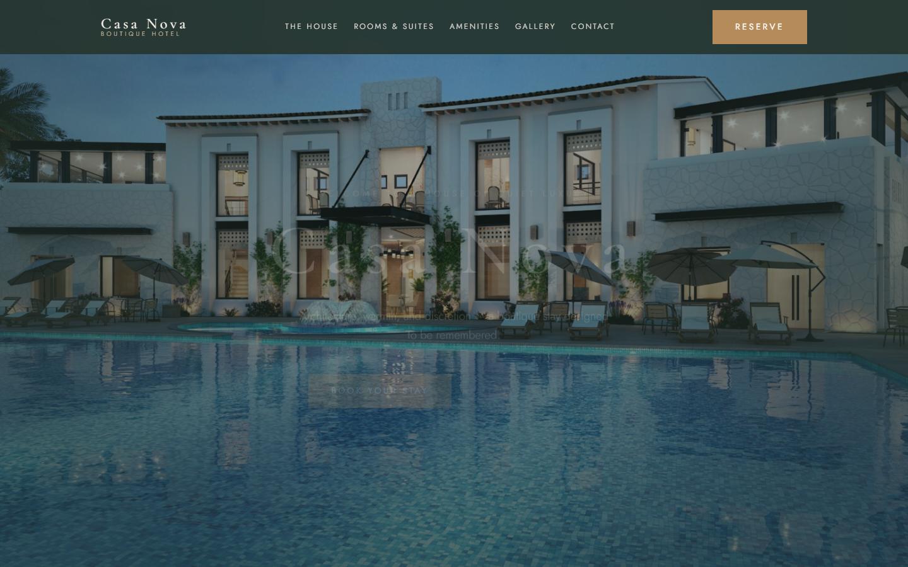
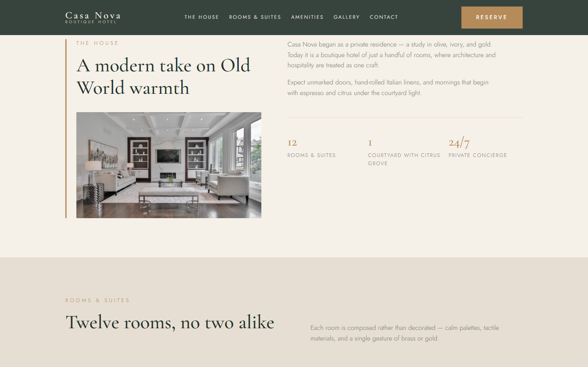
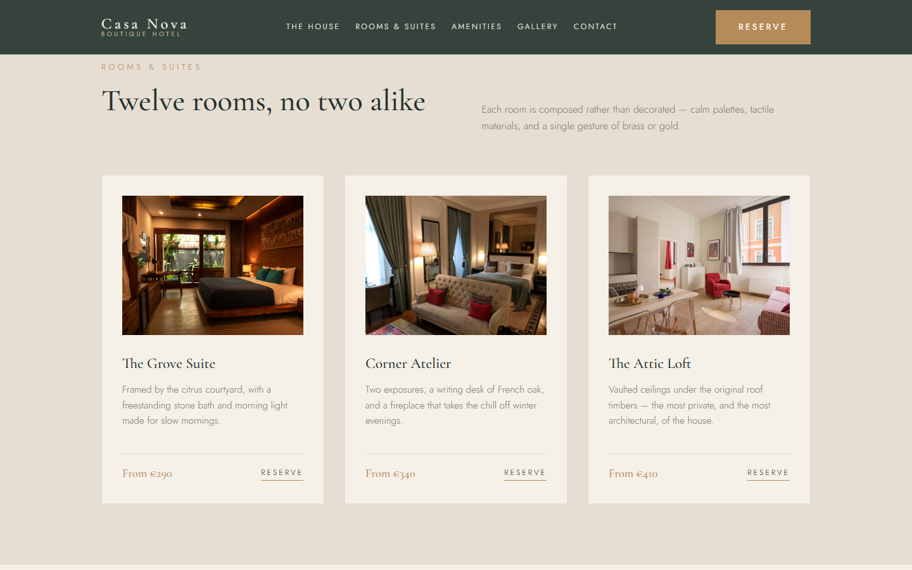
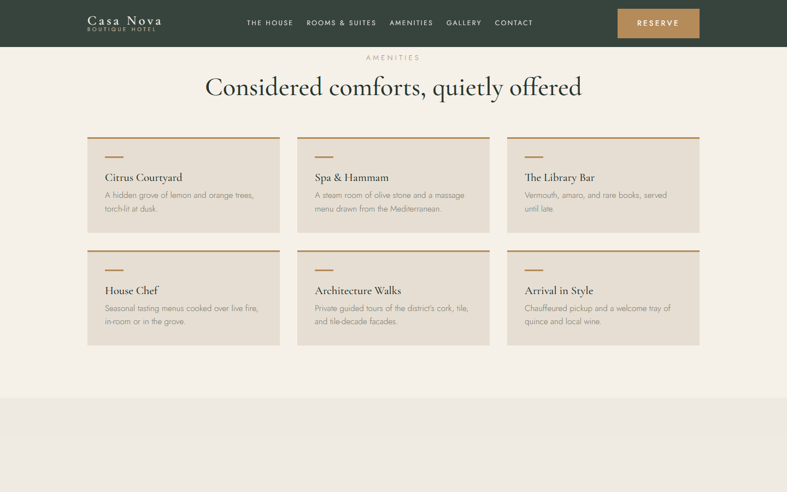
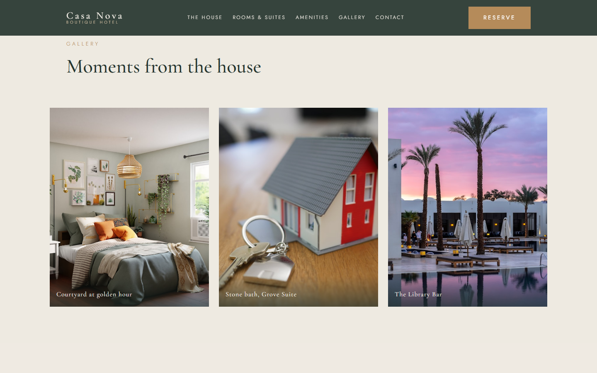
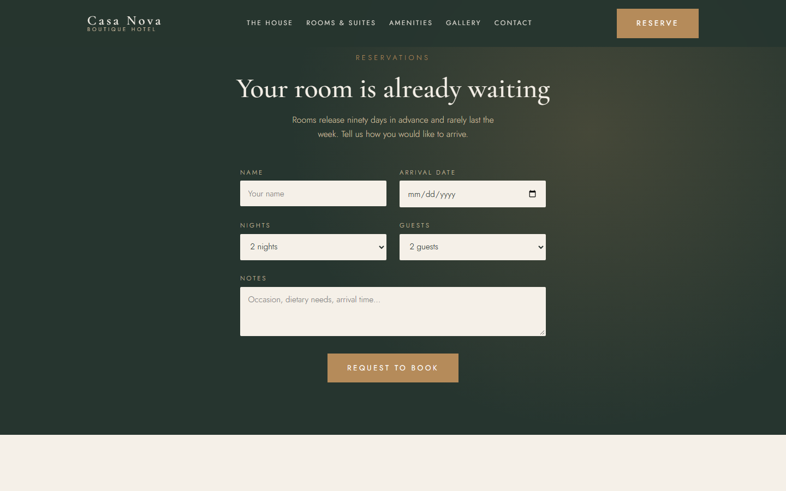
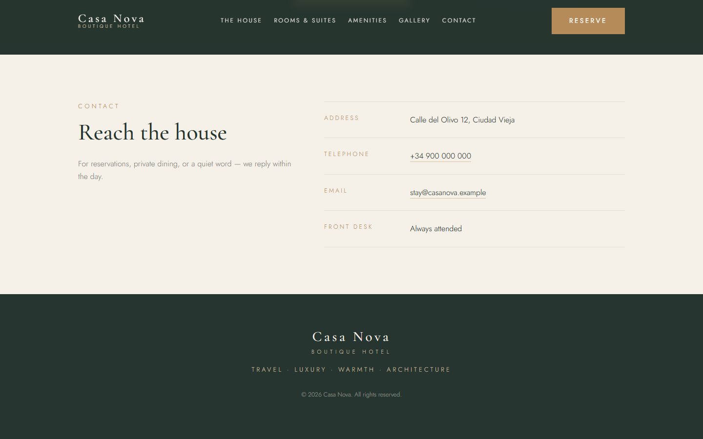

# CASA NOVA

Landing page for a fictional boutique hotel. Built as a portfolio piece.

React, Vite, plain CSS with custom properties. The colour palette comes from the CASA NOVA brand system.

Live site: **https://casa-nova.vercel.app/**

## Screenshots















## Run it

```sh
npm install
npm run dev
```

Build for production with `npm run build` (`dist/`), preview with `npm run preview`.

## Structure

- `src/components/` — one component per section (Navbar, Hero, About, Rooms, Amenities, Gallery, Booking, Contact, Footer).
- `src/index.css` — the theme tokens plus the single keyframe used (reveal).
- `src/hooks/useReveal.js`, `src/hooks/useSmoothScroll.js` — the small bits that make it move.
- `src/assets/` — the local photography referenced by each section.

## Palette

Defined once in `:root` and referenced everywhere. No stray hex values.

| Role | Hex |
|---|---|
| Primary | `#26352F` |
| Secondary | `#52665D` |
| Background | `#F5F0E8` |
| Surface | `#E6DED2` |
| Text | `#26302D` |
| Muted | `#7B7B72` |
| Accent (gold) | `#B58B5A` |
| Accent light | `#D8C3A5` |

## Known rough edges

- Photos are local placeholders from Unsplash — a mix of stock hotel and architecture shots. Swap them for real property photography before going anywhere serious; they're referenced in `src/components/`.
- The booking form is front-end only. On submit it opens the visitor's email client with a pre-filled reservation message; there's no backend behind it.
- The sticky header isn't offset by `scroll-mt`, so section anchors scroll to the very top of each section. If the header height changes, revisit anchor positioning.
- The colour palette follows the 60/30/10 rule — warm ivory as the base, deep olive for primary actions, gold reserved for luxury details.
